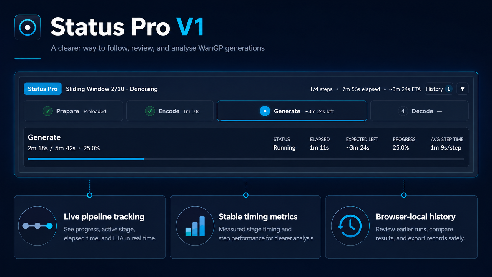
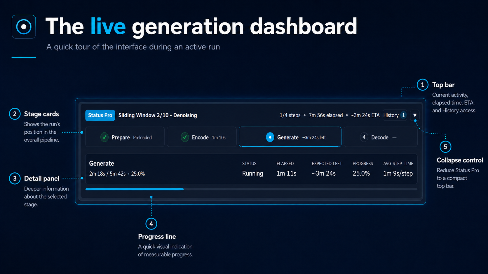
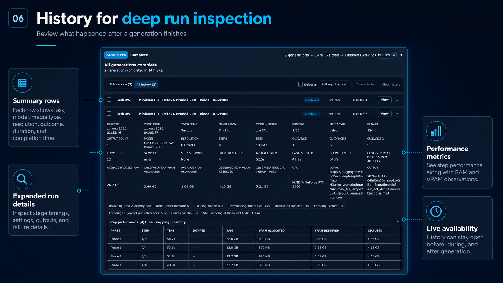
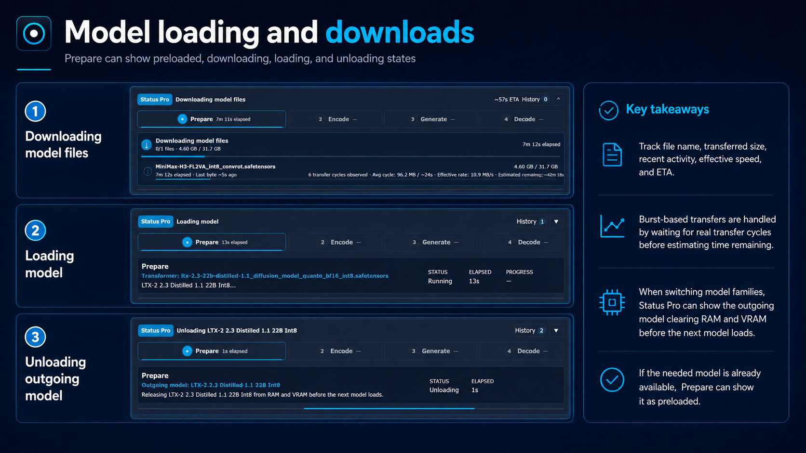
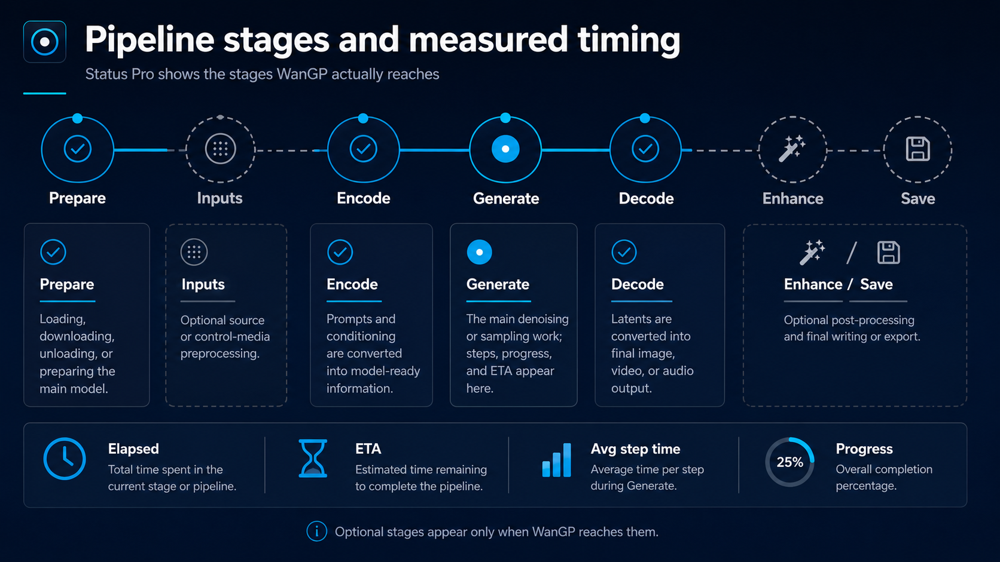
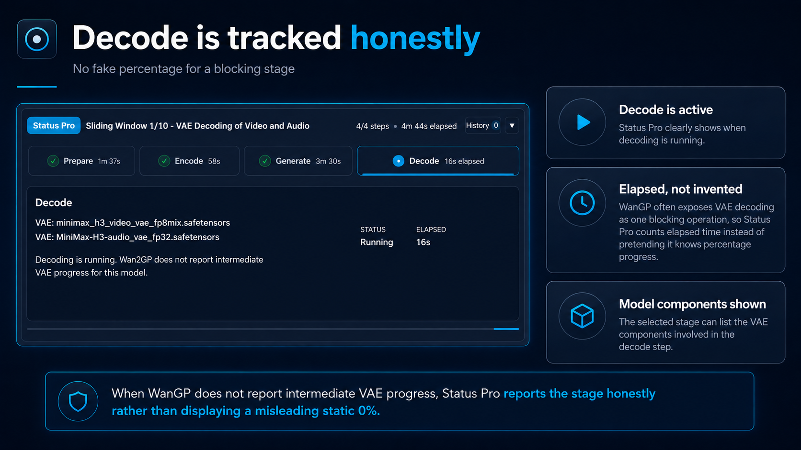
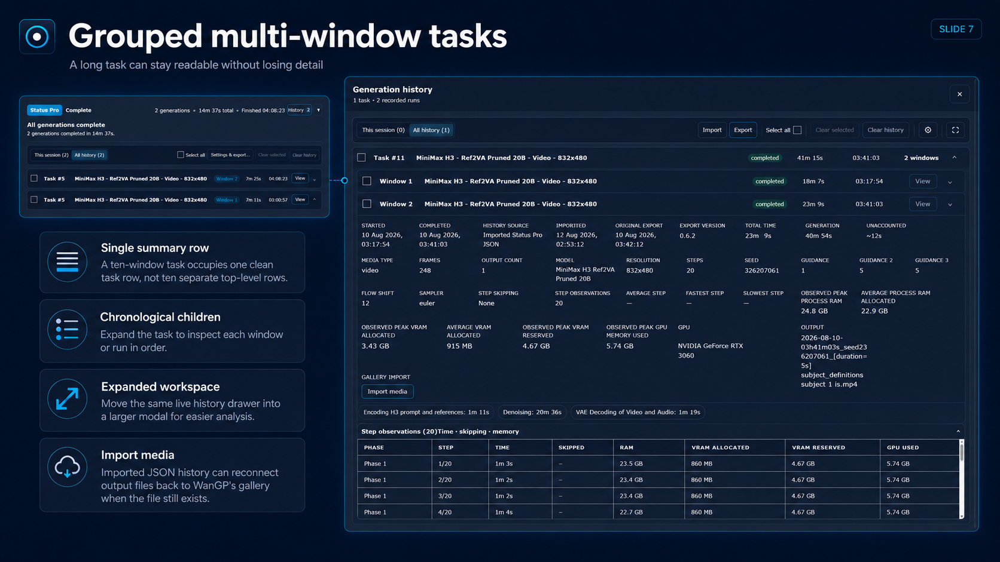
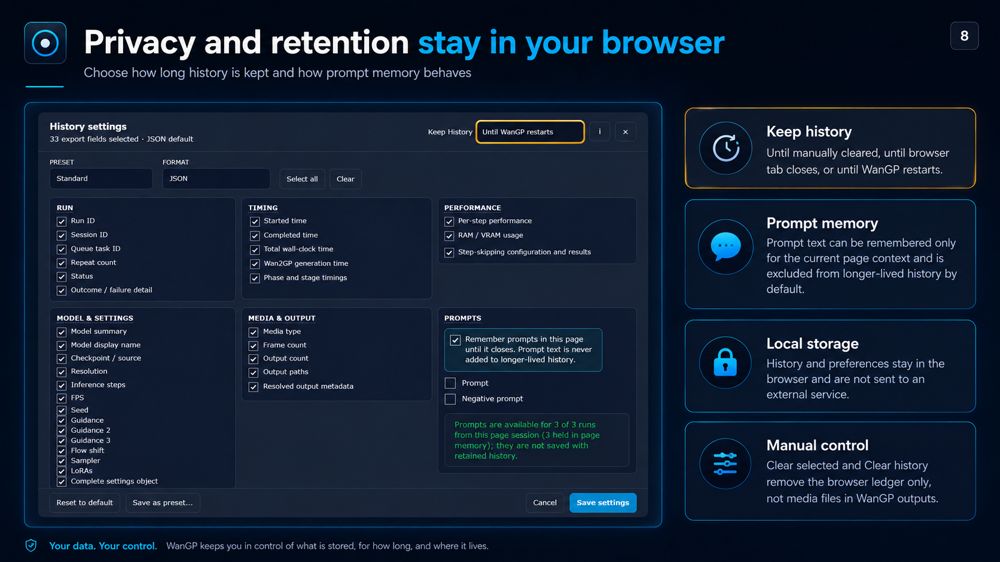
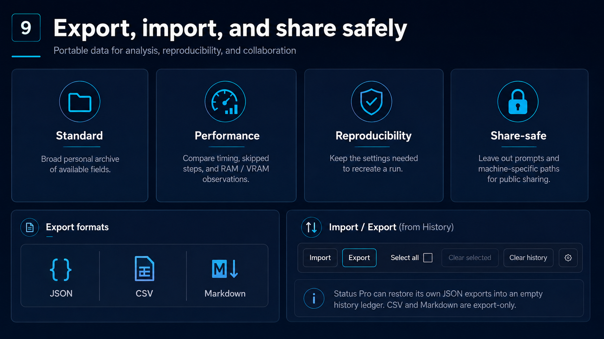
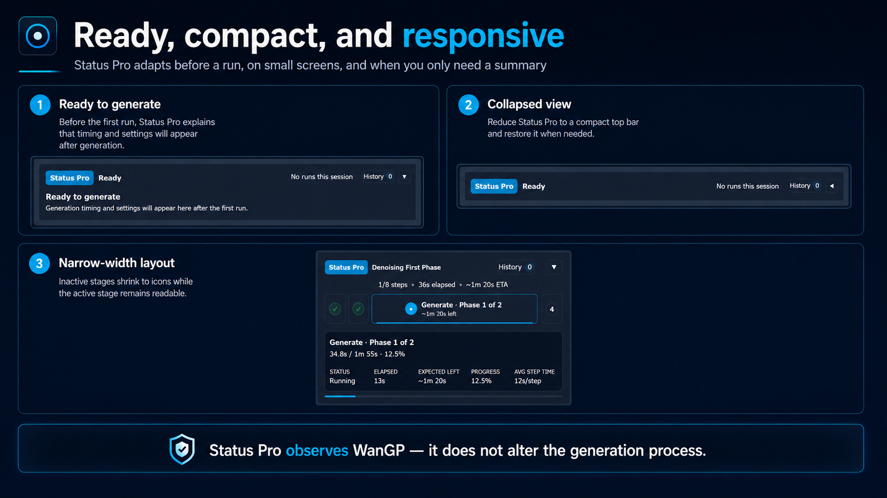

# Status Pro

Status Pro replaces Wan2GP's main status presentation with a responsive pipeline timeline and privacy-controlled local generation ledger.



Status Pro 1.0.1 has been tested with **WanGP 12.452 and later**, but does not declare a hard minimum because its observers degrade gracefully and may also work with earlier releases. It has no additional required Python dependencies; process-memory telemetry uses `psutil` when WanGP already provides it and degrades gracefully when unavailable.

[User guide](USER_GUIDE.md) · [Installation](#install-and-enable) · [Release notes](RELEASE_NOTES.md)

## What Status Pro adds

- A live, selectable view of the stages WanGP actually reaches.
- Measured elapsed time, stable denoising ETA, and per-step performance.
- Honest handling of blocking stages such as Decode when intermediate progress is unavailable.
- Browser-local history with timing, settings, output, RAM, and VRAM observations.
- JSON, CSV, and Markdown exports, plus restoration of Status Pro JSON history.
- Responsive full, narrow, and collapsed layouts that remain available throughout a run.
- Privacy controls for history lifetime, prompt memory, and share-safe exports.
- An option to disable automatic History recording while retaining the live stage-based status display.

## Visual tour

### Follow an active generation



### Inspect completed runs



### See model loading and downloads



<details>
<summary><strong>Continue the complete visual tour — 6 more slides</strong></summary>

### Pipeline stages and measured timing



### Honest Decode reporting



### Grouped multi-window history



### Privacy and retention controls



### Export, import, and share-safe presets



### Ready, compact, and responsive layouts



</details>

For a practical explanation of every stage, History, storage modes, exports, and common messages, see the [Status Pro User Guide](USER_GUIDE.md).

## Features

<details>
<summary><strong>View the complete feature list</strong></summary>

- Highlights and expands the currently running phase.
- Remains visible before generation, while running, and after a queue completes.
- Keeps the completed top bar focused on the latest generation task's full duration—including all sliding windows—while the expanded summary shows the session count, cumulative time, and latest completion clock time.
- Records up to 100 completed queue runs with model/settings metadata, outputs, per-stage durations, and completion status.
- Keeps the visible ledger consistent with browser storage limits and warns when older entries must be removed or persistence is unavailable.
- Records each completed sliding-window segment as `Window N` and resets the live phase timeline for the next window.
- Collapses multi-window or multi-run queue tasks into one history summary, with chronological child entries available on expansion.
- Uses each saved window output as a lifecycle fallback when a short-lived Wan2GP window-status transition is missed.
- Retains the prompt unit actually assigned to each sliding window for the current browser-tab session.
- Displays model filenames in history instead of long local paths or Hugging Face download URLs, while retaining the original setting in structured exports.
- Summarizes each history row with its model platform, variant, media type, and resolution; the exact checkpoint remains in the expanded details.
- Shows total wall-clock time, Wan2GP's recorded generation time, model/setup time, and only materially unaccounted time derived from observed phases.
- Exposes model-specific Guidance 2 and Guidance 3 values, and labels frame counts without implying an unknown video duration.
- Preserves aborted and failed outcomes as sticky states, with concise failure reasons such as GPU-memory exhaustion when observable.
- Resolves each completed run as image, video, or audio from its outputs; image runs report one frame and audio runs omit frame count instead of inheriting stale video-form values.
- Exports retained history as full JSON, analysis-friendly CSV, or readable Markdown.
- Restores Status Pro JSON exports into an empty history for later review; imported rows retain available metadata and can add still-existing recorded outputs back to the native Wan2GP gallery.
- Provides a draggable, viewport-contained History settings window for retention, prompt memory, export format, field selection, Standard/Performance/Reproducibility/Share-safe presets, and multiple named browser-saved custom presets.
- Explains the intended use of each preset in an in-modal guide and calls out that prompt fields are unchecked by default for privacy.
- Applies the selected fields consistently across JSON, CSV, and Markdown, with Standard defaulting to every available field except prompts.
- Lets you select individual history rows, or all rows in the active scope, for targeted exports.
- Provides tri-state task selection so one checkbox can select every window/run in a collapsed task while exports retain the individual records.
- Lets you clear selected history rows without removing the rest of the locally stored ledger.
- Keeps history in a dedicated header-controlled drawer that remains accessible during generation, with This session/All history filtering, a settings action, direct export using the saved defaults, and a large synchronized modal workspace for busy ledgers.
- Offers three history lifetimes from the settings window's top bar: until manually cleared, until the browser tab closes, or until WanGP restarts. New installations default to WanGP-restart-aware storage.
- Allows automatic History recording to be turned off without disabling live stage tracking or deleting existing records.
- Explains every retention choice in a confirmation box before switching modes.
- Keeps prompts out of the default export preset and offers a privacy setting for page-session prompt memory. The preference can persist, but prompt text never outlives its selected browser-session boundary and is removed immediately when prompt memory is disabled.
- Uses compact, content-sized stage cards whose layout responds to available width; half-width views keep the selected stage expanded and reduce other stages to accessible tick/number buttons.
- Labels the selected stage's lower detail panel with the Prepare transformer checkpoint, input VAE, Encode text encoder, or Decode VAE filenames while hiding local paths and download URLs; multiple component models are displayed one per line.
- Lets the lower detail column consume all space not required by the metrics, then shrink first as the window narrows so long model names and status information remain visible whenever space permits.
- Adds explicit history View actions that select matching video, image, or audio outputs in Wan2GP's native galleries without scrolling the page or starting playback.
- Records each emitted Wan2GP phase independently and measures its duration from observed phase boundaries, rather than using cumulative progress-bar time.
- Shows the active denoising phase and resets Decode, Enhance, and Save to pending when Wan2GP begins a later denoising phase.
- Includes the complete model loading handoff in Prepare—including the brief “Model loaded” state—and shows aborting as a live transient state.
- Covers the otherwise silent handoff between models by showing the outgoing model being released from RAM and VRAM before the incoming model begins loading.
- Marks Prepare as completed and Preloaded for any model when a new run reaches Inputs, Encode, or Generate without observable model-loading work, and preserves that distinction in run history and exports.
- Reads Wan2GP's structured input-preparation and Encode phases for every model before falling back to the rendered progress tracker. If Generate begins without a separately measurable Encode signal, the stage is resolved as Not reported rather than being left incorrectly pending or assigned an invented duration.
- Adds an optional Inputs stage only when WanGP performs source/control-media work such as control-video VAE conversion, pose/depth/face extraction, background removal, resizing, or related preprocessing.
- Keeps Inputs fixed between Prepare and Encode, lists recurring input activities individually, and accumulates their stage time when a pipeline alternates between Inputs and Encode.
- Uses Qwen Image's two existing callback boundaries to recover and time its otherwise unreported prompt/reference Encode phase; this remains an evidence-backed compatibility adapter within the model-agnostic lifecycle handling.
- Shows model-loading and model-ready status in Prepare even when an older Gradio progress tracker is still present.
- Displays required model downloads, current files, byte progress, effective transfer rate, completed files, and pending files inside Prepare.
- Shows continuous transfer elapsed time and each file's most recent byte activity, including a clear waiting state when Xet has not sent a fresh byte update.
- Learns Xet transfer cycles from observed quiet-then-progress intervals and estimates completion from cumulative bytes over wall-clock time, including quiet periods rather than assuming a fixed chunk size.
- Shows a top-bar transfer ETA only after every remaining download has learned an observed-cycle estimate, avoiding a conflicting callback-speed ETA.
- Estimates time remaining from live progress and recent step speed.
- Stabilizes denoising ETA from completed step intervals, with a smooth countdown between steps, rather than repeatedly pricing an unfinished step.
- Shows Generate and Enhance time per step using the same smoothed time-per-step format, retaining decimal precision for sub-second operations.
- Measures step time from wall-clock intervals between completed-step updates, avoiding cumulative status timers contaminating the rate.
- Records exact plugin-observed wall time for each generation callback observation, together with its phase/pass and configured step-skipping method.
- Separates configured steps from observed work across multiple passes, such as MiniMax H3 Spectrum anchor capture plus smoothing replay, instead of presenting 40 observations as a 40-step configuration.
- Records actual cache-skip events from Wan2GP's TeaCache, MagCache, Spectrum, and First Block Cache counters instead of inferring skips from unusually fast steps.
- Samples Wan2GP process RAM and active CUDA-device memory throughout each run, retains peak/average/start/end summaries, and attaches boundary samples to the per-step history.
- Adds a scrollable step-performance table to expanded history entries and dedicated performance/resource fields to JSON, CSV, and Markdown exports.
- Highlights the fastest and slowest valid step within each observed pass, while excluding skipped observations from that comparison.
- Adds a measured stage-timing composition bar with a theme-aware striped segment for wall-clock time not covered by observed stages.
- Uses clearer, top-aligned field labels in expanded History and shows compact filename-only LoRA names while preserving complete values in exports.
- Treats Wan2GP's transition into Decode as completion of its final reported generation step, avoiding a misleading 7/8 finish.
- Shows remaining time only where live progress supports it: downloads, denoising, and post-processing tasks that report incremental progress.
- Never displays speculative durations for pending stages.
- Treats Decode as indeterminate because Wan2GP's blocking VAE call exposes no intermediate units: it shows live elapsed time and activity without a percentage or ETA.
- Lets you select any stage to inspect its status, elapsed time, progress, and latest Wan2GP details.
- Adds optional Inputs, Enhance, and Save stages only when the current run actually reaches them.
- Keeps stage selection entirely in the browser so it remains responsive while generation is running.
- Collapses to a compact live header showing the stage, steps, total elapsed time, and ETA, and remembers that preference.

</details>

Download telemetry is collected by plugin-local runtime wrappers. Wan2GP and Hugging Face continue to perform the actual downloads; Status Pro only observes their progress.

## Install and enable

### Plugin Manager

1. Open WanGP's **Plugins** tab.
2. Under **Install New Plugin**, paste the public Git repository URL for `wan2gp-status-pro`.
3. Select **Download and Install Plugin**.
4. Enable `wan2gp-status-pro`, save the setting, and restart WanGP.

### Manual installation

Place the repository contents in `plugins/wan2gp-status-pro/`, enable the plugin in WanGP's **Plugins** tab, save the setting, and restart WanGP.

Updates installed through Git should be applied from the Plugins tab followed by a WanGP restart. Uninstalling or disabling Status Pro does not automatically delete history retained with **Until manually cleared**; clear it from Status Pro before removal if desired.

## Development validation

From the plugin repository root, run:

```powershell
python -m unittest discover -s tests -v
```

Node.js is optional but recommended; JavaScript-specific tests are skipped when it is unavailable.

## Privacy and local storage

Run history never leaves the browser and can be cleared from Status Pro. **Until browser tab closes** uses browser `sessionStorage`. **Until WanGP restarts** uses local storage plus a unique backend launch ID, and clears when Status Pro detects a new WanGP process. **Until manually cleared** remains available across both browser and WanGP restarts. When page-session prompt memory is enabled, prompt text can remain available only within the browser-tab session and is unchecked in exports by default; it is never added to the WanGP-runtime or manually-cleared stores. Output paths and detailed model settings may be present in Standard or Reproducibility exports; use the Share-safe preset when publishing an export.

## Current limitation

Status Pro observes the progress and active queue state already exposed by Wan2GP. A stage that does not report incremental progress receives elapsed timing but no invented ETA. Per-run queue timings are observed at half-second intervals and may differ from internal timings by a fraction of a second.

RAM and VRAM run summaries are sampled observations rather than profiler traces. Process RAM is Wan2GP's resident memory; allocated/reserved VRAM comes from PyTorch for the active CUDA device; device-used VRAM can include other applications. Status Pro retains at most the latest 300 callback step observations per observed generation phase session so unusually long token/audio jobs do not exhaust browser storage.

See [FUTURE_IMPROVEMENTS.md](FUTURE_IMPROVEMENTS.md) for the proposed native download telemetry hook and known limitations of the plugin-only observer.
